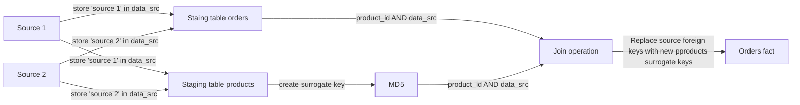
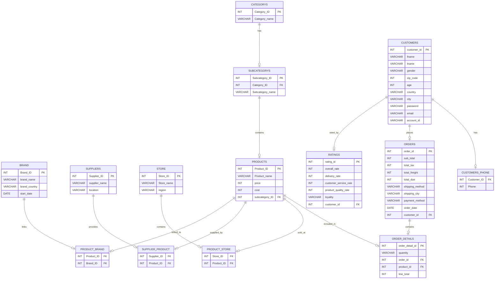
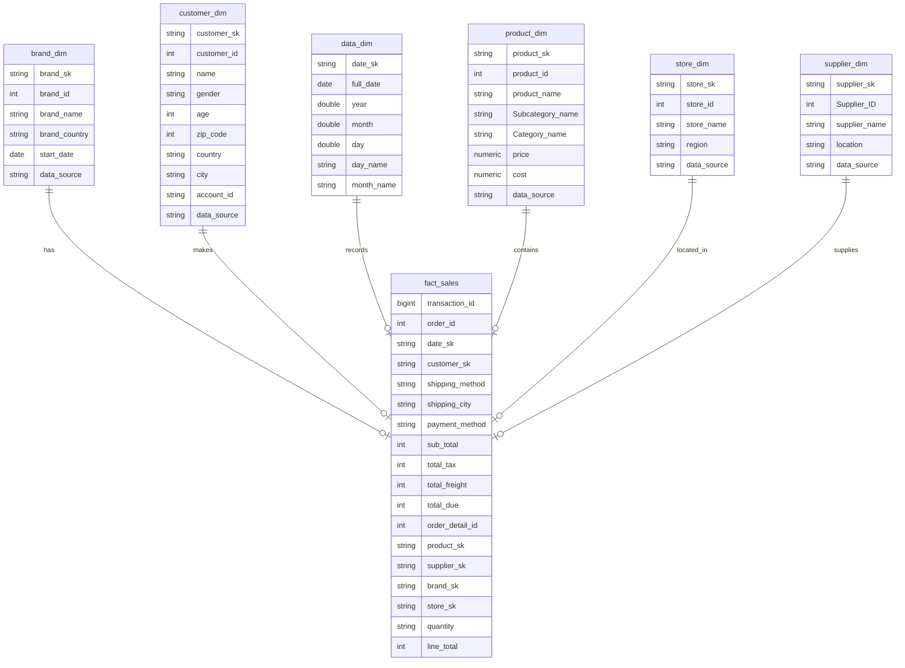

# DBT-Orchestrator

## Table of Contents
- [Introduction](#introduction)
- [Approach](#approach)
- [Tech Stack & Tools](#tech-stack--tools)
- [Assumptions](#assumptions)
- [Pipeline Architecture](#pipeline-architecture)
- [DBT Directory Structure](#dbt-directory-structure)
- [Airflow DAG Overview](#airflow-dag-overview)
- [Database Schema](#database-schema)
- [Surrogate Keys Logic](#surrogate-keys-logic)
- [ERD (Entity-Relationship Diagram)](#erd-entity-relationship-diagram)
- [Data Warehouse Model](#data-warehouse-model)
- [Data Lineage](#data-lineage)
- [Reporting](#reporting)

---

## Introduction

**DBT-Orchestrator** is a project designed to transform raw data into analytics-ready datasets using **DBT** (Data Build Tool). It integrates modular data models with a PostgreSQL data warehouse and provides a reporting layer for business intelligence and decision-making.

---

## Approach


## Tech Stack & Tools

- **DBT (Data Build Tool)**: For building and transforming data models.
- **PostgreSQL**: As the data warehouse.
- **Docker**: To containerize and standardize the development environment.
- **Python**: For scripting and automation.
- **Airflow** (optional): For orchestrating ETL workflows.
- **Power BI** (optional): For visualizing the reporting layer.

---

## Assumptions

1. PostgreSQL is the database platform used for data storage and transformations.
2. Docker is installed and used for containerized environments.
3. Required datasets are accessible in a suitable format (e.g., CSV or Parquet).

---

## Pipeline Architecture

The project follows a layered architecture:

1. **Raw Data Layer**: Holds unprocessed data.
2. **Staging Layer**: Cleans and pre-processes data.
3. **OLAP Models**: 
   - **Dimension Models**: Prepares dimension tables for analysis.
   - **Fact Models**: Aggregates and calculates business metrics.

### DBT Directory Structure
```plaintext
dbt/
├── ecommerce/
│   ├── models/
│   │   ├── staging/          # Staging models
│   │   ├── olap_model/       # OLAP models directory
│   │   │   ├── dimensions/   # Dimension models
│   │   │   ├── fact/         # Fact models
│   ├── dbt_project.yml       # DBT project configuration
│   └── profiles.yml          # DBT profiles configuration
```
## Airflow DAG Overview
If using Airflow for orchestration, the DAG performs the following tasks:

Extract: Reads raw data from source olap database or APIs.
Load: Loads data into the PostgreSQL database.
Transform: Executes DBT models to build staging, dimension, and fact tables.
## Database Schema
Staging Tables:

stg_orders: Pre-processed orders data.
stg_customers: Pre-processed customer data.
Dimension Tables (in olap_model/dimensions):

dim_customers: Cleaned and deduplicated customer records.
dim_products: Product metadata.
Fact Tables (in olap_model/fact):

fact_sales: Aggregated sales metrics.


## Surrogate Keys Logic

| Surrogate Key   | Logic                                        |
|-----------------|----------------------------------------------|
| `product_sk`     | MD5 Hash of cleaned `product_name`          |
| `supplier_sk`   | MD5 Hash of cleaned `supplier_name`          |
| `customer_sk`   | MD5 Hash of cleaned `customer_name`          |
| `data_sk`       | MD5 Hash of cleaned `date` (from `dim_date`) |
| `brand_sk`       | MD5 Hash of cleaned `brand|| datasource`   |
| `store_sk`       | MD5 Hash of cleaned store_name|| datasource`   |

## ERD (Entity-Relationship Diagram)
### Logical Model


## Data Warehouse Model

## Data Lineage


## Reporting
### overview


### order details 


